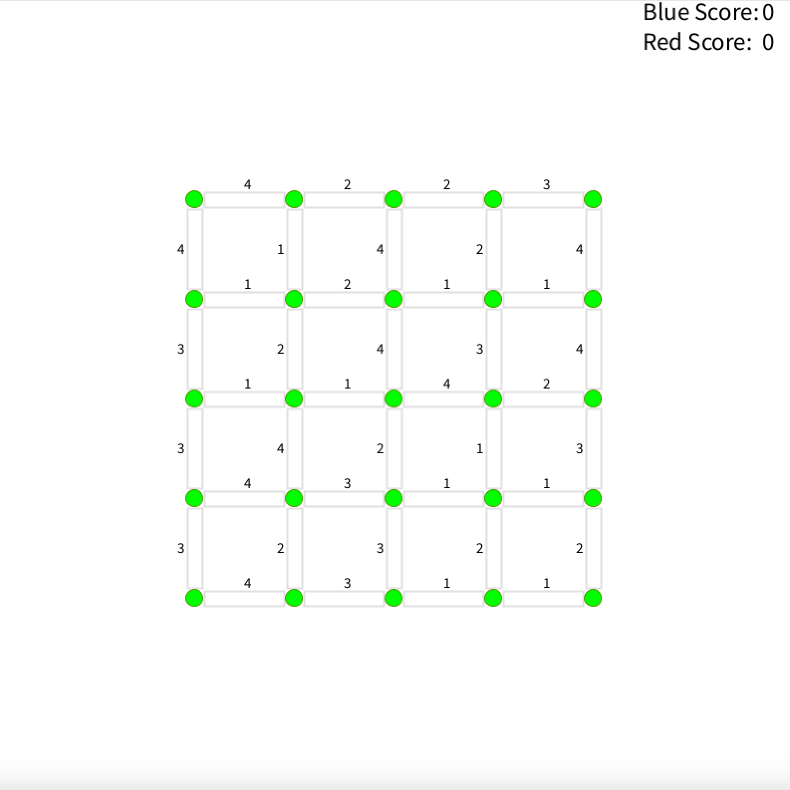
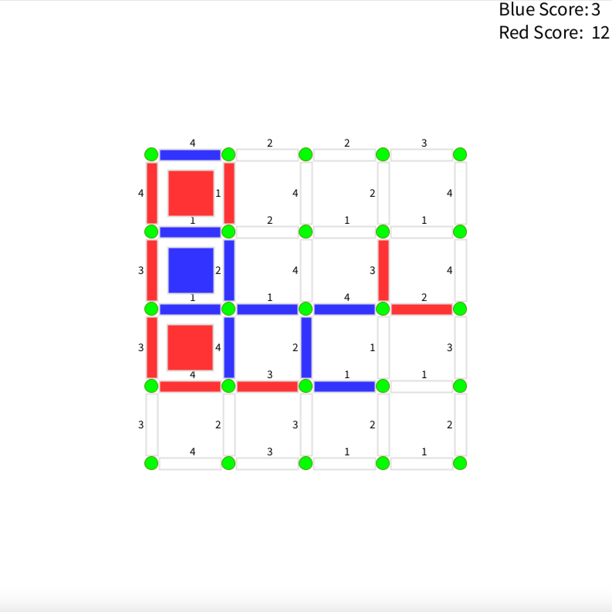
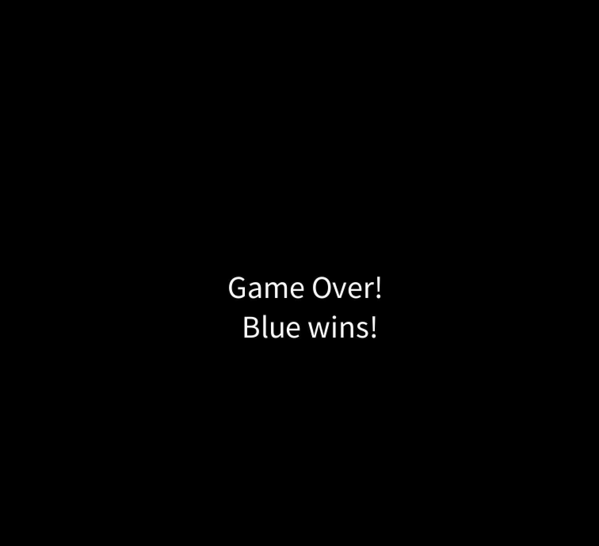

# Colored Squares Game

**Colored Squares Game** is a two-player interactive game where participants compete to claim squares on a 2D grid by coloring line segments. The goal is to color the most squares or, in the case of a tie, achieve the highest total score by accruing the weight of the claimed line segments.

---

## 🎮 Features

- **Two-Player Competitive Gameplay**: Players alternate turns to color line segments on the grid.
- **Scoring System**: Each line segment has a randomly assigned weight (1–4), contributing to the player’s score when a square is claimed.
- **Square Claiming**: A square is claimed when a player colors two or more line segments to "close off" the square.
- **Game Over Conditions**:
  - All squares are claimed.
  - No more line segments are available for coloring.
- **Visual Feedback**:
  - Colored line segments and squares (red for Player 1, blue for Player 2).
  - Scoreboard displayed on the top-right corner of the screen.
- **Restart and Termination**:
  - Press `q`, `Q`, `x`, or `X` to quit.
  - Click anywhere on the screen after the game ends to restart.

---

## 🚀 How to Run

### Prerequisites

- **Processing IDE** with the **Python mode** installed.
  - Download Processing: [https://processing.org/download](https://processing.org/download)
  - Add Python Mode: Open Processing, go to `Modes`, and install `Python`.

### Instructions

1. **Clone the Repository**:
   ```bash
   git clone https://github.com/AbdullahSuri/Colored-Squares-Game.git
   ```
2. **Navigate to the Project Folder**:
   ```bash
   cd Colored-Squares-Game
   ```
3. **Open the Game in Processing**:

- Launch the Processing IDE.
- Open colored-square-game.pyde from the project folder.

4. **Run the Game**:

- Click the Run button in Processing (or press Ctrl + R).

## 📖 How to Play

1. **Initial Setup**:

- A grid appears with uncolored line segments and randomly assigned weights (1–4) displayed on the screen.

2. **Gameplay**:

- Players take turns clicking on uncolored line segments to claim them.
- If a player colors two or more line segments to "close off" a square, the square is claimed, and the sum of the segment weights is added to the player’s score.

3. **Winning**:

- The game ends when all squares are claimed or no line segments remain.
- The player with the highest number of claimed squares wins. In case of a tie, the player with the highest total score wins.
  Restart/Exit:

## 🛠️ Built With

- Processing Framework: For creating the graphical interface and handling mouse/keyboard interactions.
- Python Mode: For implementing the game logic.

💻 Demo
Initial Board:

### Initial Board

A 4x4 grid appears with uncolored line segments and random weights. This is what the game looks like at the start:


### Mid-Game

As players take turns, line segments are claimed, and squares are colored:


### End Game

When all squares are claimed, the game ends, and the winner is announced:

